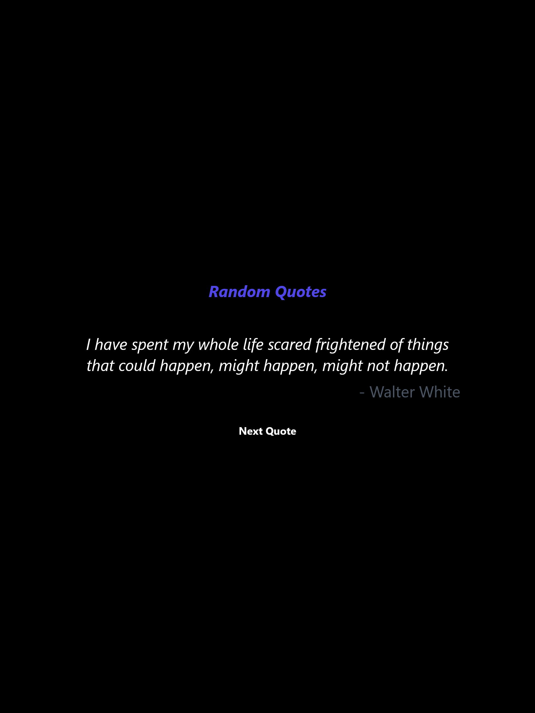

# RandomQuote!

¡Bienvenido a RandomQuote! 🚀

## Tecnologías Utilizadas

## Descripción

RandomQuote es mi proyecto personal de gestión de citas construido con React. En esta aplicación, puedes explorar citas aleatorias usando la API de Breaking Bad.

## Características

- Interfaz Intuitiva: Un diseño fácil de usar para una experiencia de usuario fluida.

- Tecnologías Modernas: Utiliza tecnologías actuales como React para un desarrollo eficiente.

Puedes probar la aplicación [aquí](https://sparkquote.netlify.app/).

## Contacto

- [Twitter](https://twitter.com/_luisalmenarez)
- [Instagram](https://www.instagram.com/_luisalmenarez/)
- [LinkedIn](https://www.linkedin.com/in/luisalmenarez/)
